# Table Transfer Workflows by Data Strategy

## Executive Summary

This document details the complete workflow for transferring different table types (ACID, Managed, External) using each HMS-Mirror data strategy, including when and how distcp can facilitate data movement.

## Table Type Overview

### Table Classifications

| Table Type | Characteristics | Data Ownership | Location Control |
|------------|----------------|----------------|------------------|
| **ACID** | Transactional, ORC format, delta files | Always owned | Restricted |
| **Managed** | Hive controls lifecycle | Owned by Hive | Hive-controlled |
| **External** | Data exists independently | Not owned | User-controlled |
| **External+Purge** | External with ownership | Owned | User-controlled |

## Strategy Workflow Matrix

| Strategy | ACID Support | Managed Support | External Support | DistCp Usage |
|----------|-------------|-----------------|------------------|--------------|
| SCHEMA_ONLY | ❌ | ✅ | ✅ | Primary (manual) |
| LINKED | ❌ | ✅ | ✅ | Never |
| SQL | ✅ (transfer) | ✅ | ✅ | Never |
| EXPORT_IMPORT | ⚠️ | ✅ | ✅ | Optional (staging) |
| HYBRID | ✅ (transfer) | ✅ | ✅ | Conditional |
| STORAGE_MIGRATION | ✅ (special) | ✅ | ✅ | Primary |
| COMMON | ⚠️ | ✅ | ✅ | Never |

---

## 1. SCHEMA_ONLY Strategy Workflows

### Workflow: External Table

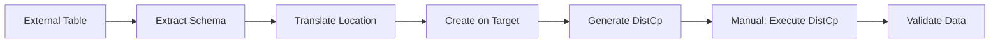

**Steps**:
1. **Schema Extraction**: Read table DDL from source
2. **Location Translation**: Apply namespace/warehouse mappings
3. **Target Creation**: Create table with translated location
4. **DistCp Generation**: Create scripts for data movement
5. **Manual Execution**: User runs distcp scripts
6. **Validation**: Verify data transfer completion

**DistCp Configuration**:
```yaml
dataStrategy: SCHEMA_ONLY
transfer:
  storageMigration:
    dataMovementStrategy: DISTCP
```

**Generated DistCp**:
```bash
hadoop distcp \
  hdfs://source/warehouse/db/external_table \
  hdfs://target/warehouse/external/db/external_table
```

### Workflow: Managed Table

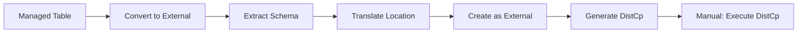

**Steps**:
1. **Conversion**: Managed → External (if configured)
2. **Schema Extraction**: Read converted DDL
3. **Location Translation**: Apply mappings
4. **Target Creation**: Create as EXTERNAL
5. **DistCp Generation**: Create movement scripts
6. **Manual Execution**: User runs distcp

**Special Handling**:
- Sets PURGE option if ownership transfer enabled
- Location explicitly set for external table

### Workflow: ACID Table

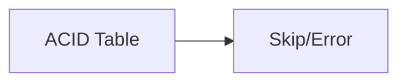

**Behavior**: ACID tables are skipped or generate errors
**Reason**: Cannot use distcp for ACID format

---

## 2. LINKED Strategy Workflows

### Workflow: External Table

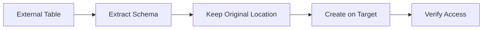

**Steps**:
1. **Schema Extraction**: Read table DDL
2. **Location Preservation**: Keep source location
3. **Target Creation**: Create pointing to source
4. **Access Verification**: Test cross-cluster access

**No DistCp Required**: Data remains in original location

### Workflow: Managed Table

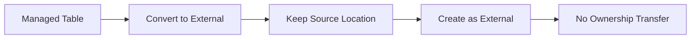

**Steps**:
1. **Conversion**: Managed → External (required)
2. **Location Preservation**: Keep source location
3. **Target Creation**: Create as EXTERNAL
4. **No PURGE**: Cannot claim ownership

### Workflow: ACID Table

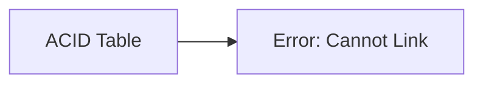

**Behavior**: Fails with error
**Error Message**: "Can't LINK ACID tables"

---

## 3. SQL Strategy Workflows

### Workflow: External Table

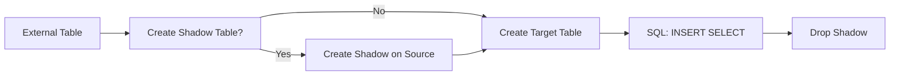

**Steps**:
1. **Shadow Creation** (if targetNamespace set):
   - Create shadow table on source cluster
   - Points to source data
2. **Target Creation**: Create final table on target
3. **Data Transfer**: SQL INSERT ... SELECT
4. **Cleanup**: Drop shadow table

**SQL Example**:
```sql
-- On target cluster
INSERT INTO target_db.table
SELECT * FROM shadow_db.shadow_table;
```

### Workflow: Managed Table

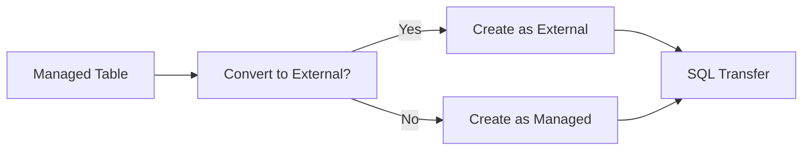

**Conversion Logic**:
- Legacy managed → External on modern
- Preserve managed if same version

### Workflow: ACID Table

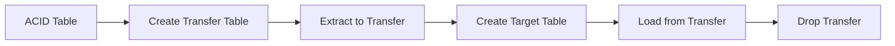

**Steps**:
1. **Transfer Table Creation**:
   ```sql
   CREATE EXTERNAL TABLE transfer_table
   STORED AS ORC
   LOCATION 's3://intermediate/transfer/'
   ```

2. **Data Extraction**:
   ```sql
   INSERT INTO transfer_table
   SELECT * FROM acid_table;
   ```

3. **Target Creation**: ACID or EXTERNAL based on config

4. **Data Load**:
   ```sql
   INSERT INTO target_table
   SELECT * FROM transfer_table;
   ```

5. **Cleanup**: Drop transfer table

**No DistCp**: SQL engine handles all data movement

---

## 4. EXPORT_IMPORT Strategy Workflows

### Workflow: External Table

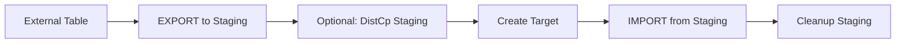

**Steps**:
1. **Export Command**:
   ```sql
   EXPORT TABLE source_table 
   TO 'hdfs://shared/export/table_name'
   ```

2. **Optional DistCp** (if staging not accessible):
   ```bash
   hadoop distcp \
     hdfs://source/export/table_name \
     hdfs://target/import/table_name
   ```

3. **Import Command**:
   ```sql
   IMPORT TABLE target_table 
   FROM 'hdfs://shared/export/table_name'
   ```

### Workflow: Managed Table

Similar to External, with automatic conversionResult handling during IMPORT

### Workflow: ACID Table

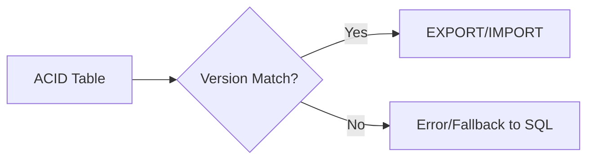

**Limitation**: ACID v1 to v2 incompatibility

---

## 5. HYBRID Strategy Workflows

### Decision Tree

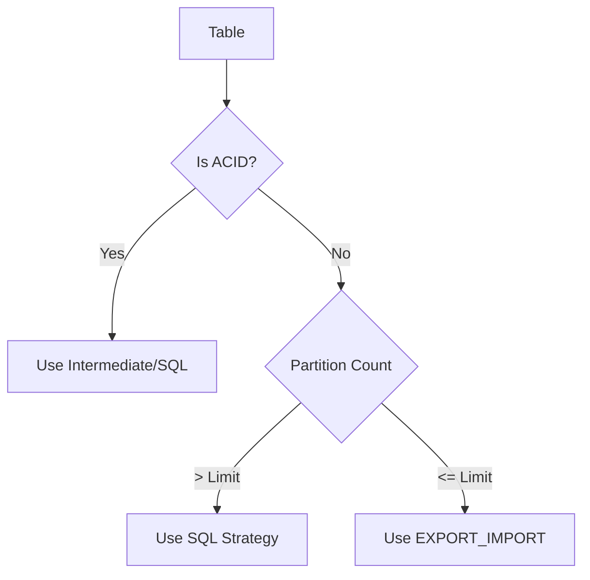

### Workflow: ACID Table

Always routes through Intermediate strategy with transfer table

### Workflow: Large Partitioned Table (>limit)

Follows SQL strategy workflow

### Workflow: Small Table or Few Partitions

Follows EXPORT_IMPORT strategy workflow

---

## 6. STORAGE_MIGRATION Strategy Workflows

### Workflow: External Table with DistCp

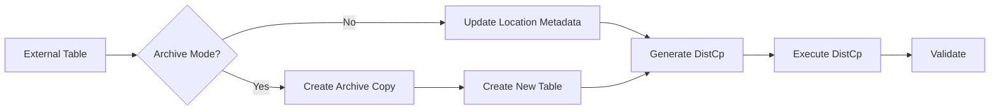

**No Archive Mode**:
1. **Metadata Update**:
   ```sql
   ALTER TABLE table_name 
   SET LOCATION 'hdfs://target/new/location'
   ```

2. **DistCp Generation**:
   ```bash
   hadoop distcp \
     hdfs://source/old/location \
     hdfs://target/new/location
   ```

**Archive Mode**:
1. **Rename Original**:
   ```sql
   ALTER TABLE table_name 
   RENAME TO table_name_archive
   ```

2. **Create New**:
   ```sql
   CREATE TABLE table_name
   LOCATION 'hdfs://target/new/location'
   ```

3. **DistCp Execution**

### Workflow: Managed Table with DistCp

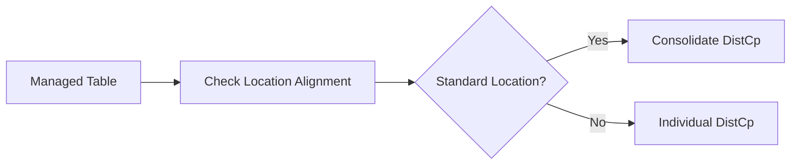

**Consolidation Decision**:
- Standard locations → Database-level distcp
- Non-standard → Table-level distcp

### Workflow: ACID Table

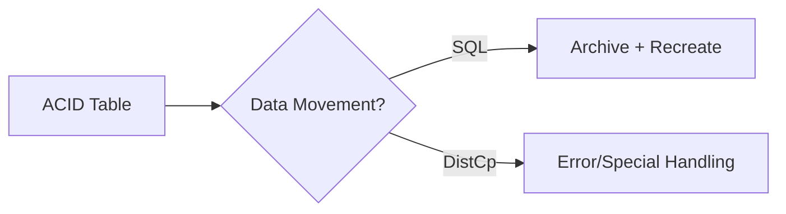

**SQL Mode**: Creates archive, transfers via SQL
**DistCp Mode**: Generally not supported, requires downgrade

---

## 7. COMMON Strategy Workflows

### Workflow: All Table Types


**Requirements**:
- Shared storage between clusters
- Same namespace accessibility
- Compatible versions for ACID

**No DistCp Required**: Storage is shared

---

## DistCp Integration Patterns

### Pattern 1: Primary DistCp (SCHEMA_ONLY, STORAGE_MIGRATION)

**Configuration Required**:
```yaml
transfer:
  storageMigration:
    dataMovementStrategy: DISTCP
    dataFlow: PULL  # or PUSH
    consolidateTablesForDistcp: true
```

**Workflow**:
1. Schema operations complete
2. DistCp scripts generated
3. Manual execution required
4. Validation recommended

### Pattern 2: Optional DistCp (EXPORT_IMPORT)

**Use Case**: Staging area transfer
```bash
# Move export files if not accessible
hadoop distcp \
  hdfs://source/export/ \
  hdfs://shared/import/
```

### Pattern 3: No DistCp (SQL, LINKED, COMMON)

**Data Movement Via**:
- SQL: Query engine
- LINKED: No movement
- COMMON: Shared storage

### Pattern 4: Conditional DistCp (HYBRID)

Depends on sub-strategy selected:
- SQL path → No distcp
- EXPORT_IMPORT path → Optional distcp

---

## Special Handling by Table Type

### ACID Tables

| Strategy | Handling | Transfer Table | DistCp Support |
|----------|----------|----------------|----------------|
| SCHEMA_ONLY | Skip/Error | No | No |
| LINKED | Error | No | No |
| SQL | Via Transfer | Yes | No |
| EXPORT_IMPORT | Version Check | No | No |
| HYBRID | Force SQL | Yes | No |
| STORAGE_MIGRATION | SQL/Downgrade | Sometimes | Limited |
| COMMON | Direct (if compatible) | No | No |

### Managed Tables

| Strategy | Conversion | Location Control | DistCp Support |
|----------|------------|------------------|----------------|
| SCHEMA_ONLY | To External | Explicit | Yes |
| LINKED | To External | Source | No |
| SQL | Optional | Controlled | No |
| EXPORT_IMPORT | Automatic | Preserved | Optional |
| HYBRID | Per Sub-strategy | Varies | Conditional |
| STORAGE_MIGRATION | Optional | Updated | Yes |
| COMMON | Preserved | Same | No |

### External Tables

| Strategy | Ownership | Location | DistCp Support |
|----------|-----------|----------|----------------|
| SCHEMA_ONLY | Optional PURGE | Translated | Yes |
| LINKED | No PURGE | Source | No |
| SQL | Optional PURGE | New | No |
| EXPORT_IMPORT | Preserved | New | Optional |
| HYBRID | Per Sub-strategy | Varies | Conditional |
| STORAGE_MIGRATION | Preserved | Updated | Yes |
| COMMON | Preserved | Same | No |

---

## Workflow Decision Guide

### Choosing the Right Strategy

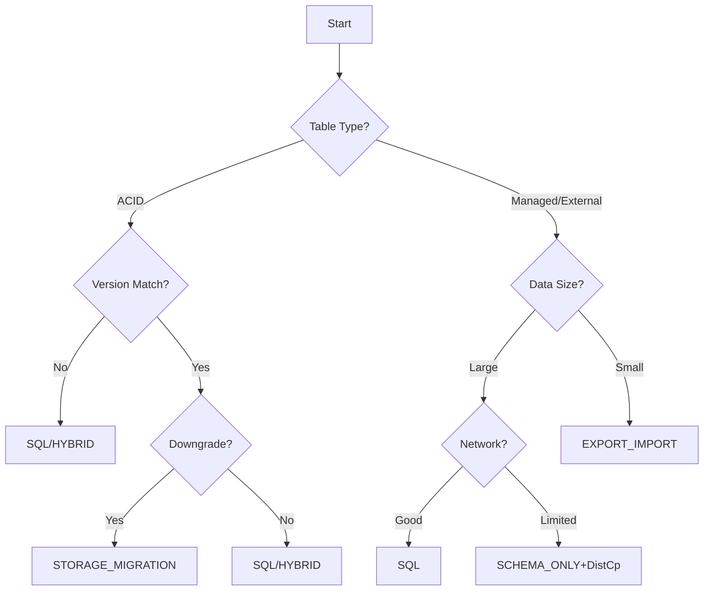

### DistCp Applicability

**Use DistCp When**:
- SCHEMA_ONLY strategy selected
- STORAGE_MIGRATION with non-ACID tables
- Large data volumes with limited compute
- Network bandwidth available for transfer
- Precise control over data movement needed

**Avoid DistCp When**:
- ACID tables (use SQL instead)
- LINKED strategy (no movement needed)
- COMMON strategy (shared storage)
- Small datasets (EXPORT_IMPORT more convenient)
- Non-standard locations requiring complex mapping

---

## Best Practices by Table Type

### ACID Tables
1. Always use SQL-based strategies
2. Plan for transfer table creation
3. Consider downgrade if appropriate
4. Never attempt direct distcp

### Managed Tables
1. Consider conversionResult to External
2. Verify ownership requirements
3. Check location alignment for distcp
4. Plan for warehouse changes

### External Tables
1. Validate location translations
2. Decide on PURGE option
3. Use consolidation for efficiency
4. Verify partition locations

---

## Summary

The workflow for transferring tables varies significantly based on:

1. **Table Type**: ACID requires special handling, Managed may need conversionResult, External most flexible
2. **Strategy Selected**: Determines data movement method
3. **DistCp Configuration**: When enabled, affects workflow execution
4. **Location Standards**: Non-standard locations complicate workflows

Key patterns:
- **ACID tables** always require SQL-based movement (never distcp)
- **SCHEMA_ONLY** and **STORAGE_MIGRATION** are primary distcp users
- **Transfer tables** created for ACID migrations and intermediate storage
- **Location validation** critical for successful distcp execution
- **Consolidation** optimizes large-scale migrations

Success factors:
- Choose strategy based on table type first
- Configure distcp appropriately for strategy
- Validate location mappings before execution
- Monitor transfer table lifecycle
- Plan for non-standard location handling