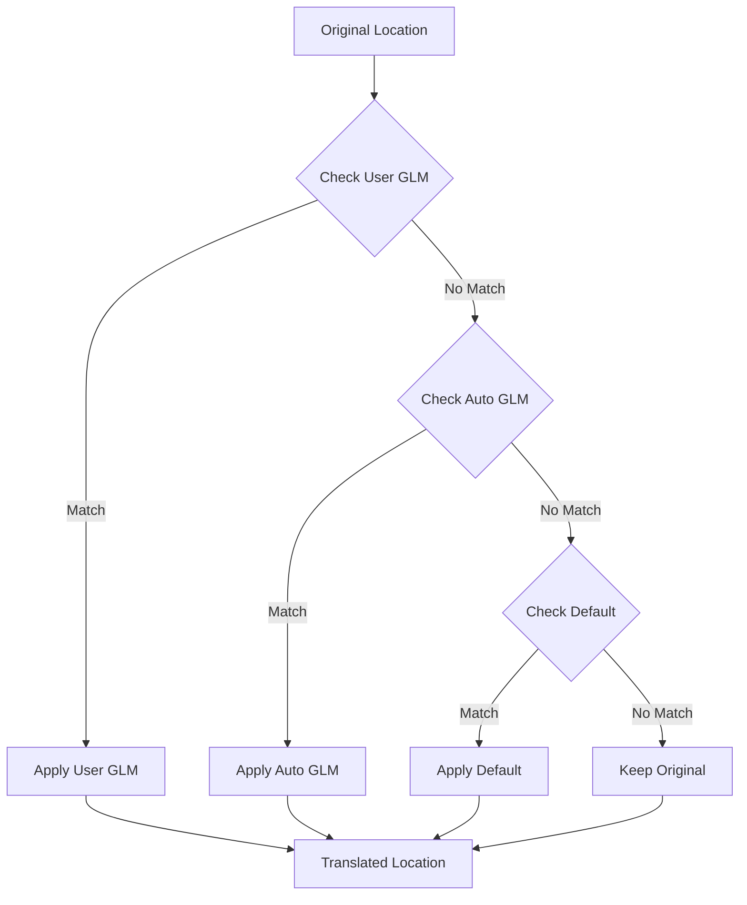

# Warehouse Plans and Global Location Maps in HMS-Mirror

## Executive Summary

Warehouse Plans in HMS-Mirror provide a mechanism to reorganize database tables from scattered hierarchical locations in traditional HDFS storage into consolidated, well-organized structures suitable for modern object storage systems like Ozone and S3. These plans are automatically translated into Global Location Maps (GLMs) that control location translations during migration, with a defined precedence order ensuring consistent and predictable transformations.

## The Storage Organization Challenge

### Traditional HDFS Storage Pattern

In traditional Hadoop deployments with HDFS, table locations often become scattered over time:

```
/apps/hive/warehouse/sales.db/customers
/user/analytics/sales.db/transactions  
/data/archive/sales.db/historical_orders
/tmp/staging/sales.db/temp_data
/warehouse/external/sales.db/vendor_data
```

**Problems**:
- Tables scattered across multiple root directories
- Inconsistent naming conventions
- Mixed managed and external locations
- Organic growth without structure
- Difficult to manage permissions and quotas

### Modern Object Storage Pattern

Modern object storage systems (S3, Ozone) benefit from consolidated, structured layouts:

```
s3://bucket/warehouse/managed/sales.db/
s3://bucket/warehouse/external/sales.db/
```

**Benefits**:
- Clear separation of managed vs. external
- Consistent bucket/container structure
- Simplified access control
- Better cost management
- Easier lifecycle policies

## Warehouse Plans Architecture

### Core Components

```yaml
warehousePlans:
  database_name:
    source: PLAN           # PLAN, GLOBAL, or AUTO
    externalDirectory: "/warehouse/tablespace/external"
    managedDirectory: "/warehouse/tablespace/managed"
```

### Key Characteristics

1. **Database-Level Configuration**: Plans are defined per database
2. **Table Type Separation**: Distinct paths for managed and external tables
3. **Base Path Definition**: Paths exclude database name (automatically appended)
4. **Source Tracking**: Origin of plan (user-defined, global, or auto-generated)

## How Warehouse Plans Work

### Phase 1: Source Collection

HMS-Mirror collects existing table locations from the source system:

```java
// Collected during metadata discovery
SourceLocationMap {
  "sales_db": {
    EXTERNAL_TABLE: {
      "/apps/hive/warehouse/sales": ["customers", "orders"],
      "/data/archive/sales": ["historical_data"]
    },
    MANAGED_TABLE: {
      "/user/analytics/sales": ["transactions"],
      "/tmp/staging/sales": ["temp_tables"]
    }
  }
}
```

### Phase 2: Warehouse Plan Definition

User defines target organization structure:

```yaml
transfer:
  warehousePlans:
    sales_db:
      externalDirectory: "/warehouse/external"
      managedDirectory: "/warehouse/managed"
    
    analytics_db:
      externalDirectory: "/warehouse/external"  
      managedDirectory: "/warehouse/managed"
```

### Phase 3: GLM Generation

Warehouse Plans are automatically converted to Global Location Maps:

```java
// Generated GLM from Warehouse Plans
GlobalLocationMap {
  "/apps/hive/warehouse/sales": {
    EXTERNAL_TABLE: "/warehouse/external/sales_db",
    MANAGED_TABLE: "/warehouse/managed/sales_db"
  },
  "/data/archive/sales": {
    EXTERNAL_TABLE: "/warehouse/external/sales_db"
  },
  "/user/analytics/sales": {
    MANAGED_TABLE: "/warehouse/managed/sales_db"
  }
}
```

## Global Location Map (GLM) Generation Process

### Algorithm Overview

```java
buildGlobalLocationMapFromWarehousePlansAndSources() {
  for each warehousePlan {
    database = warehousePlan.database
    warehouse = warehousePlan.warehouse
    sources = getSources(database)
    
    for each source in sources {
      // Strip namespace
      sourceLocation = stripNamespace(source.location)
      
      // Reduce to database level
      reducedLocation = reduceUrlBy(sourceLocation, 0)
      
      // Create GLM entry
      if (source.type == EXTERNAL) {
        targetLocation = warehouse.externalDirectory + "/" + database
        if (!sourceLocation.startsWith(targetLocation)) {
          GLM.add(reducedLocation, EXTERNAL, targetLocation)
        }
      }
      
      if (source.type == MANAGED) {
        targetLocation = warehouse.managedDirectory + "/" + database  
        if (!sourceLocation.startsWith(targetLocation)) {
          GLM.add(reducedLocation, MANAGED, targetLocation)
          
          // Handle conversions (managed → external)
          if (possibleConversions) {
            GLM.add(reducedLocation, EXTERNAL, 
                   warehouse.externalDirectory + "/" + database)
          }
        }
      }
    }
  }
}
```

### Key Generation Rules

1. **Path Reduction**: Source paths reduced to database level
2. **Namespace Stripping**: Remove protocol/namespace before comparison
3. **Conditional Addition**: Only add GLM if source doesn't match target
4. **Conversion Handling**: Account for managed → external conversions
5. **Database Suffix**: Append database name to warehouse base paths

## GLM Precedence and Application Order

### Precedence Hierarchy

The GLM application follows a strict precedence order:

```
1. User-Defined GLMs (Highest Priority)
   ↓
2. Warehouse Plan GLMs (Auto-Generated)
   ↓
3. Default Translations (Lowest Priority)
```

### Implementation Details

```java
public Map<String, Map<TableType, String>> getOrderedGlobalLocationMap() {
  orderedGlobalLocationMap = new TreeMap<>(new StringLengthComparator());
  
  // Auto GLMs first (from Warehouse Plans)
  if (autoGlobalLocationMap != null) 
    orderedGlobalLocationMap.putAll(autoGlobalLocationMap);
  
  // User GLMs override (higher precedence)
  if (userGlobalLocationMap != null) 
    orderedGlobalLocationMap.putAll(userGlobalLocationMap);
    
  return orderedGlobalLocationMap;
}
```

### StringLengthComparator

GLMs are sorted by path length (longest first) to ensure most specific matches:

```java
class StringLengthComparator implements Comparator<String> {
  public int compare(String s1, String s2) {
    // Longer strings come first
    if (s1.length() != s2.length()) {
      return s2.length() - s1.length();
    }
    // Same length, alphabetical order
    return s1.compareTo(s2);
  }
}
```

**Example Ordering**:
```
/apps/hive/warehouse/sales/customers     (longest, checked first)
/apps/hive/warehouse/sales
/apps/hive/warehouse
/apps                                     (shortest, checked last)
```

## Location Translation Process

### Translation Pipeline



### Translation Example

**Original Table Location**: `/legacy/warehouse/sales/customers`

**Step 1: Check User GLMs**
```yaml
userGlobalLocationMap:
  /legacy/special: 
    EXTERNAL: /priority/location
  # No match for /legacy/warehouse
```

**Step 2: Check Auto GLMs (from Warehouse Plans)**
```yaml
autoGlobalLocationMap:
  /legacy/warehouse:
    EXTERNAL: /warehouse/external/sales_db
    MANAGED: /warehouse/managed/sales_db
  # Match found!
```

**Result**: `/warehouse/external/sales_db/customers`

## Database Location Control

### Setting Database Properties

Warehouse Plans control future database locations through DDL:

```sql
-- External tables location
ALTER DATABASE sales_db 
SET LOCATION 's3://bucket/warehouse/external/sales_db';

-- Managed tables location (Hive 3+)
ALTER DATABASE sales_db 
SET MANAGEDLOCATION 's3://bucket/warehouse/managed/sales_db';
```

### Impact on New Tables

After migration with Warehouse Plans:

```sql
-- New external table uses database location
CREATE EXTERNAL TABLE new_external_table (...);
-- Location: s3://bucket/warehouse/external/sales_db/new_external_table

-- New managed table uses managed location  
CREATE TABLE new_managed_table (...);
-- Location: s3://bucket/warehouse/managed/sales_db/new_managed_table
```

## Configuration Examples

### Example 1: Simple Consolidation

**Source Layout**:
```
/user/hive/warehouse/db1
/apps/analytics/db1
/data/external/db1
```

**Warehouse Plan**:
```yaml
warehousePlans:
  db1:
    externalDirectory: "/warehouse/external"
    managedDirectory: "/warehouse/managed"
```

**Generated GLM**:
```yaml
/user/hive/warehouse:
  EXTERNAL: /warehouse/external/db1
  MANAGED: /warehouse/managed/db1
/apps/analytics:
  EXTERNAL: /warehouse/external/db1
  MANAGED: /warehouse/managed/db1
/data/external:
  EXTERNAL: /warehouse/external/db1
```

### Example 2: Multi-Database with Custom Paths

**Warehouse Plans**:
```yaml
warehousePlans:
  sales_db:
    externalDirectory: "/bronze/external"
    managedDirectory: "/silver/managed"
  
  analytics_db:
    externalDirectory: "/silver/external"
    managedDirectory: "/gold/managed"
```

**Result Structure**:
```
/bronze/external/sales_db/       # Sales external tables
/silver/managed/sales_db/        # Sales managed tables
/silver/external/analytics_db/   # Analytics external tables
/gold/managed/analytics_db/      # Analytics managed tables
```

### Example 3: Override with User GLM

**Auto GLM (from Warehouse Plan)**:
```yaml
/old/location:
  EXTERNAL: /warehouse/external/db
```

**User GLM Override**:
```yaml
/old/location/special:
  EXTERNAL: /custom/special/location
```

**Translation Results**:
```
/old/location/special/table → /custom/special/location/table (User GLM)
/old/location/normal/table → /warehouse/external/db/normal/table (Auto GLM)
```

## Special Considerations

### 1. Legacy Hive Managed Conversions

When migrating from Legacy Hive (managed tables) to modern Hive (external tables):

```java
if (possibleConversions) {
  // Add both managed and external mappings
  GLM.add(source, MANAGED, managedTarget);
  GLM.add(source, EXTERNAL, externalTarget);
}
```

### 2. Partition Location Handling

Partitions with non-standard locations are handled separately:

```java
if (!partitionLocation.startsWith(tableLocation)) {
  // Partition has custom location
  // Create specific GLM entry for partition path
  addPartitionGLM(partitionLocation, targetLocation);
}
```

### 3. Object Storage Optimization

For object storage targets (S3, Ozone):

```yaml
warehousePlans:
  database:
    # Shallow directory structure for object storage
    externalDirectory: "/external"  # Not /warehouse/tablespace/external
    managedDirectory: "/managed"    # Not /warehouse/tablespace/managed
```

## Monitoring and Validation

### GLM Application Tracking

HMS-Mirror provides visibility into GLM applications:

```sql
-- Added to table properties
TBLPROPERTIES (
  'hms-mirror.glm.applied' = 'true',
  'hms-mirror.glm.original' = '/old/scattered/location',
  'hms-mirror.glm.translated' = '/warehouse/external/db',
  'hms-mirror.glm.source' = 'AUTO'  -- or USER
)
```

### Validation Checks

1. **Path Existence**: Verify target paths are accessible
2. **Permission Check**: Ensure write permissions on target
3. **Conflict Detection**: Identify overlapping GLM patterns
4. **Coverage Analysis**: Find unmapped source locations

## Best Practices

### 1. Planning Phase
- Analyze current location scatter
- Design target organization structure
- Consider object storage limitations
- Plan for future growth

### 2. Configuration
```yaml
# Recommended structure
warehousePlans:
  ${database}:
    externalDirectory: "/warehouse/external"  # Consistent base
    managedDirectory: "/warehouse/managed"    # Clear separation
```

### 3. Testing
- Start with single database
- Verify GLM generation
- Check translation results
- Validate distcp plans

### 4. Migration Execution
- Apply warehouse plans incrementally
- Monitor GLM applications
- Verify data accessibility
- Update documentation

## Troubleshooting

### Common Issues

**Issue 1: GLM Not Applied**
```yaml
Symptom: Location not translated
Cause: Source path not in GLM
Solution: Add user GLM or adjust warehouse plan
```

**Issue 2: Wrong Precedence**
```yaml
Symptom: Unexpected translation
Cause: User GLM overriding auto GLM
Solution: Review GLM precedence order
```

**Issue 3: Partial Matches**
```yaml
Symptom: Incomplete path translation
Cause: GLM path too specific/general
Solution: Adjust path reduction level
```

## Summary

Warehouse Plans provide a powerful mechanism for:

1. **Reorganizing Storage**: Transform scattered locations into structured layouts
2. **Automated Translation**: Generate GLMs automatically from plans
3. **Future Control**: Set database locations for new tables
4. **Precedence Management**: Clear hierarchy for translation rules
5. **Object Storage Optimization**: Adapt hierarchical structures for flat namespaces

Key benefits:
- **Consistency**: Uniform storage organization
- **Automation**: Reduced manual mapping effort
- **Flexibility**: Override capability via user GLMs
- **Scalability**: Database-level management
- **Compatibility**: Works with various storage systems

The combination of Warehouse Plans and GLMs enables seamless migration from traditional HDFS hierarchies to modern object storage paradigms while maintaining data accessibility and organization.